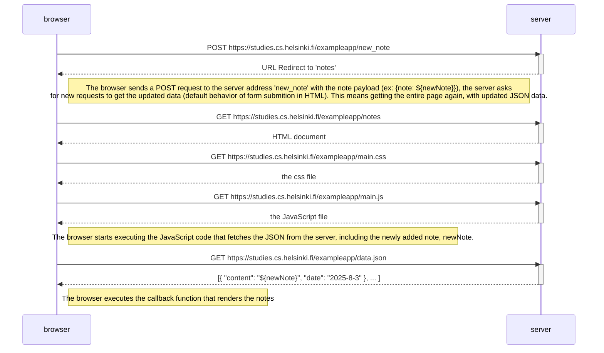

Diagram for part 0.4 of the Fullstack Open project showing the diagram depicting the situation where the user creates a new note on the page https://studies.cs.helsinki.fi/exampleapp/notes by writing something into the text field and clicking the Save button.

The difference between this diagram and the one used [here](https://fullstackopen.com/en/part0/fundamentals_of_web_apps#loading-a-page-containing-java-script-review) is the addition of the POST request send to the 'new_note' address with the payload of the new note at the start of the diagram. After the POST request, the server asks for a new request of the 'notes' address in order to get the updated list. This also triggers GET requests in order to get the HTML,CSS,JS and data.json, each with its own request.

