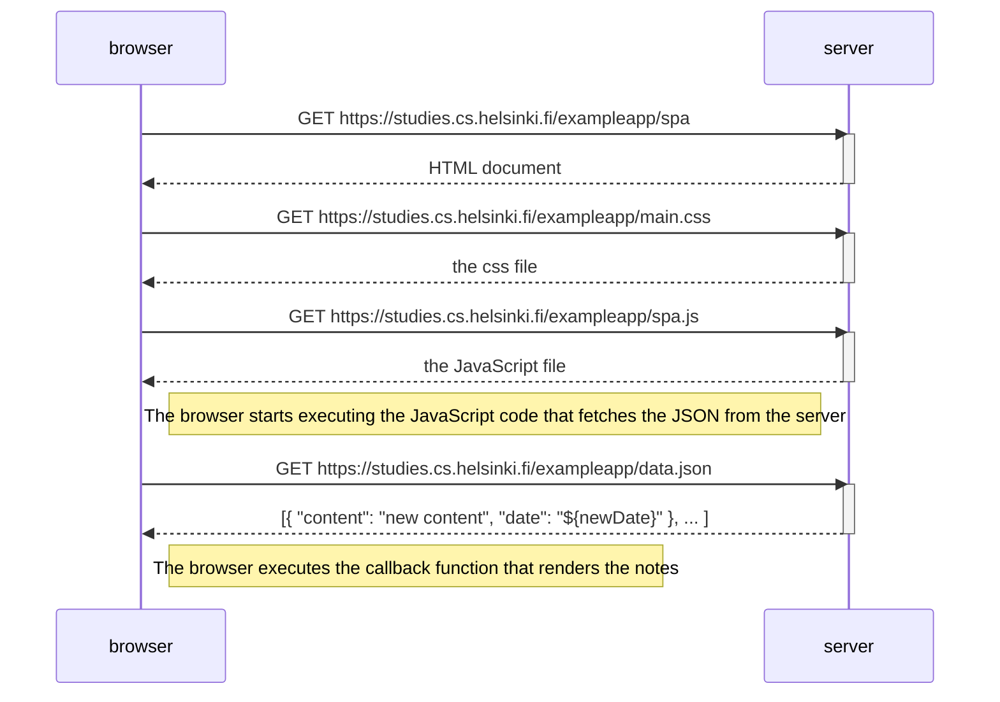

Diagram for part 0.5 of the Fullstack Open project showing the diagram depicting the situation where the user opens the page https://studies.cs.helsinki.fi/exampleapp/spa.

The diagram is similar to the one used in the course, only the file naming being changed.

