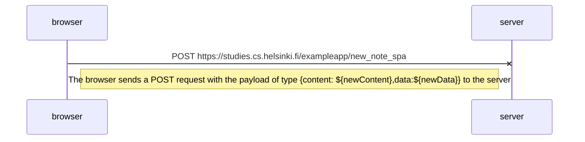

Diagram for part 0.6 of the Fullstack Open project showing the diagram depicting the situation where the user creates a new note on the page https://studies.cs.helsinki.fi/exampleapp/spa by writing something into the text field and clicking the Save button.

The browser doesn't refresh on request send, only updating the interface on the browser and sending the actual change to the server, using a technique similar to optimistic update ( the UI is behaving as though a change was successfully completed before receiving confirmation from the server that it actually was ). The page doesn't reload because of the event.preventDefault() function that stops the refresh.

